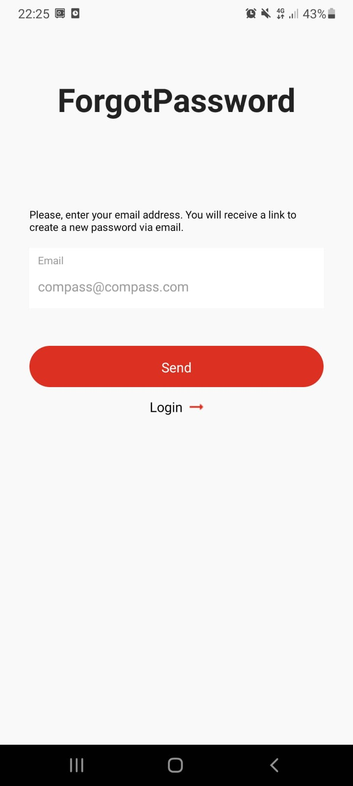

# Compass Sales

O aplicativo Compass_Sales foi desenvolvido com React Native. Neste projeto, utilizei um banco de dados do Firebase para autenticar e criar novos usuários. Utilizei nesse projeto a biblioteca Axios para simplificar a realização de requisições HTTP a servidores, tornando mais fácil obter e enviar dados pela web em aplicativos. Além de ultilizar o AsyncStorage para armazenar dados locais de forma assíncrona, facilitando a persistência de informações como configurações e dados de sessão do usuário. Foi utilizado também o CLI como plataforma de suporte para o desenvolvimento.

## Visão Geral

O aplicativo pode criar um usuário, autenticá-lo, realizar a recuperação de senha com base nos dados coletados e direcioná-lo para a tela principal de Home Page.

## Capturas de Tela

Inclua algumas capturas de tela do seu aplicativo para dar aos usuários uma ideia visual do que esperar.

## Funcionalidades Principais

- Criação de usuário
- Autenticação de usuário

# Inicie o aplicativo

npm start
npm run android
